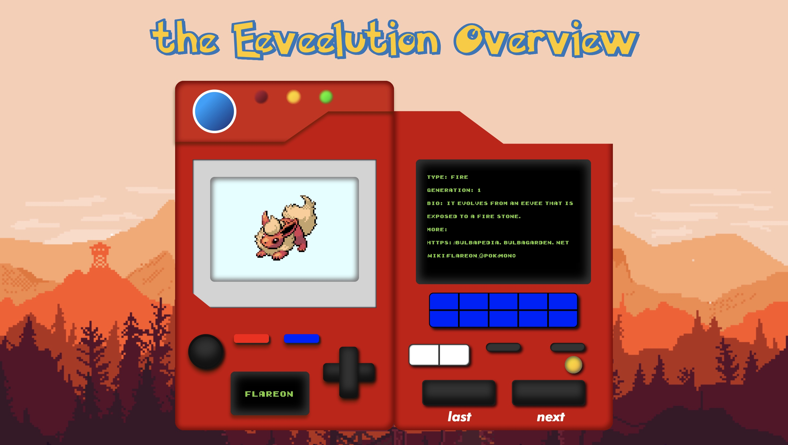

# Procesverslag
Markdown is een simpele manier om HTML te schrijven.  
Markdown cheat cheet: [Hulp bij het schrijven van Markdown](https://github.com/adam-p/markdown-here/wiki/Markdown-Cheatsheet).

Nb. De standaardstructuur en de spartaanse opmaak van de README.md zijn helemaal prima. Het gaat om de inhoud van je procesverslag. Besteedt de tijd voor pracht en praal aan je website.

Nb. Door *open* toe te voegen aan een *details* element kun je deze standaard open zetten. Fijn om dat steeds voor de relevante stuk(ken) te doen.

## Jij

### Ontwerper:
Yarre Wille

#### Je startniveau:
Mijn startniveau is: Rood

# Je plan

  
De eerste versie/schets van je ontwerp & je persoonlijke uitdaging

  ### De eerste versie/schets:
  

  ### Je ambitie: 
  Aan deze technieken/punten wil ik werken:
  - Animaties en transities in CSS
  - Beter worden in JS
  - Een nette text schrijven
 

## Voortgang/Feedback 1

  
Mijn bevindingen + wijzigingen (minimaal 5)

  ### Bevinding 1:
  Ik was nog niet helemaal tevreden met mijn keuze voor het onderwerp. Eerst was ik van plan om te werken aan een tijdlijn en daarbij had ik Wario als idee. Maar ik merkte dat ik niet echt veel ideeen kon bedenken en dat ik al snel een beetje vast liep.

  #### oplossing:
  Uiteindelijk ben ik dan doorgegaan met het idee van de Eevee. Zelf ken ik de pokemon namelijk wel maar niet helemaal de werking. Het leek mij dus wel intressant om hier mee door te gaan. Ook vind ik de basis van  dit ontwerp een stuk beter om mee te werken. 

  ### Bevinding 2:
  Ik had eigenlijk twee ideeen waar ik mee bezig was en niet echt een keuze tussen kon maken. Het eerste idee was een Pokedex waar alle informaatie over de verschillende Eevee gezien kan worden en de gebruiker door middel van de knoppen kan navigeren en geinformeerd kan worden. Na een beetje onderzoek was ik er achter gekomen dat in de originele game's van Pokemon de Eevee als eerste gevonden kan worden in een bepaald huis in een bepaalde stad. Ook zijn er verschillende evoluties van Eevee bijgekomen over de jaren heen. Bijna elke generatie van de games introduceerd wel een nieuwe soort. Het leek mij intressant om op elke etage of kamer van dat gebouw dus een andere generatie of soort Eevee te laten zien.

  #### oplossing:
  Na de feefback ronden werd het duidelijk dat het doel van het gekozen onderwerp is om mensen iets uit te leggen waar ze niets over weten. En hoewel de Pokedex niet al te origineel is is het wel erg duidelijk en overzichtelijk. Ik heb er daarom voor gekozen om met dit idee verder te gaan en misschien later nog andere onderdelen van het tweede idee toe te voegen aan mijn ontwerp.

## Voortgang/Feedback 2

  
Mijn bevindingen + wijzigingen (minimaal 5)

  
  ### Bevinding 1:
  Ik had nog niet echt geexperimenteerd met verschillende fonts. De fonts werden ook niet goed getoond op GitHub. Hierdoor was het gevoel van de pokedex nog niet helemaal echt. Het voelt gelijk heel erg als een work in proces als er nog niet een passende typografie in staat.

  #### oplossing:
  Ik heb wat onderzoek gedaan naar verschillende fonts en gekeken wat pokemon voor de pokedex gebruikt en inspiratie gehaald van de Nintendo Gameboy. Hier door heb ik twee font kunnen uitkiezen die ik nu gebruik in mijn ontwerp. Dit is een pixel art font voor de text in het scherm en voor de buttons heb ik Futura Bold Italc gebruikt. Voor de manier van toepassen in de code heb ik @font-face gebruikt. Boven in de css heb ik alle fonts neergezet en later op de juiste plekken gebruikt.

  ### Bevinding 2:
  In mijn ontwerp had ik wel al buttons met inetractie alleen deze hadden geen states en hadden geen feedback. Hierdoor was dit gelijk ook nog niet passend bij het ontwerp. 

  #### oplossing:
  Gelijk ben ik aan de slag gegaan om een active state te gebruiken bij de buttons. Ik had namelijk al wel een idee hoe ik van plan was om de states weer te geven. Het moest namelijk gaan lijken op een oude gamepad zoals de Nintendo Gamboy of een andere console. Het lijk namelijk net alsof de Pokedex uit de eerste Generatie hier namelijk ook veel inspiratie vandaan heeft gehaald.

  ### Bevinding 3:
  De structuur van mijn site was nog niet op alle punten optimaal. De hoofd-content van de pagina stond namelijk nog niet in een main en ik had ook nog geen header. Verder had ik wel al goed de informatie in sections en de Divs alleen gebruikt voor het stijlen van mijn ontwerp.

  #### oplossing:
  Ik ben door mijn code gegaan om een overzicht te maken van wat er nog veranderd moest worden en wat er netter uit kon zien. Zo heb ik gelijk de belangrijkste dingen aangepast zoals het gebruiken van een Main. 

  ### Bevinding 4:
  Het commentaar in mijn CSS kon nog duidelijker en ook meer. Ik had namelijk wel al op sommige delen aangegeven waar de CSS voor was. Maar dit had ik eigenlijk alleen gedaan zodat het duidelijk was voor mijzelf. Als ik iemand anders er naar liet kijken was het nogsteeds onduidelijk. Ook kon ik nog wel meer commentaar geven per sectie of onderdeel van de pagina.

  #### oplossing:
  Ik ben begonnen met het geven van commentaar in de CSS. En ik ga nu ook elke keer als ik meer code heb geschreven kijken og het nog wel overzichtelijk is of dat er meer commentaar bij kan staan.

  ### Bevinding 5:
  De volgorde van de CSS properties zijn vaak nog niet al te duidelijk. Er werd aangegeven dat iedereen hier zo zijn eigen manier bvoor heeft en dat het best random kan staan. Maar alsnog is het voor overzicht en werkflow wel handig om bepaalde dingen zoals groote of kleur bij elkaar te zetten om dit consistent te doen. 

  #### oplossing:
  Het vooral duidelijk maken voor mijzelf. Veel had ik al wel gegroepeerd maar alsnog kon het een stuk netter. Dus de padding, margin en border properties bij elkaar, kleur bij elkaar, positie bij elkaar, etc. En ook zorgen dat de volgorde vaak het zelfde is. Dus als ik een h1 aanspreek om dan eerste te beginnen met groote dan kleur, etc.

  ### Bevinding 5: 
  Nog geen bronvermelding. 

  #### oplossing:
  Wel de bronnen vermelden.

  ### To-Do na Feedback:
  -Header aanpassen, kijken naar stijl en text.
  -Responsive optimaliseren.
  -Kijken naar goede fonts
  -Nog even kijken naar het contrast.
  -Kijken naar de navigatie met het keyboard, Hoe kan ik ook terug via een keyboard.
  -States van de buttons maken.
  -Aanmaken van een goede structuur, Header main en footer etc.
  -Benaming van CSS selectoren beter. 
  -Meer comments in de code zodat het overzichtelijk word voor mijzelf maar ook voor andere.
  -Kijken naar de volgorde binnen de CSS.

  -Body background veranderen bij het gebruik van de buttons. Naar volgende Eevee moet ook een ander thema zijn. 
  -Text voor de informatie veranderen bij het gebruik van de buttons. Elke keer nieuwe info over de type van de Pokemon.

## Voortgang/Feedback 3

  
Mijn bevindingen + wijzigingen (minimaal 5)

  
  ### Bevinding 1:
  De titel van de h1 had ik nog niet aangepast. Als in content en vormgeving. Ik kon hier nog wel wat mee doen om het ontwerp geheel te maken.

  #### oplossing:
  Ik heb een font gezocht die heel goed werkt met het pokemon thema. Dit font had een fill en outline versie. Ik heb de fill versie gebruikt en er zelf een outline aan gegeven om het Originele Pokemon logo na te maken. De kleuren die ik heb gebruikt zijn dezelfde kleuren die Pokemon zelf ook gebruikt.

  ### Bevinding 2:
  Om de sfeer van het ontwerp totaal te maken wilde ik nog dat bij het navigeren door de verschillende eevee ook de achtergond van de eevee veranderd. Ik moest er ook voor zorgen dat deze in hetzelfde thema bleven.

  #### oplossing:
  Ik ben op zoek gegaan naar verschillende pixel art backgrounds die passen bij de verschillende eeveelutions. Zo heb ik water achterground gevonden, een nacht achtergrond , etc. En het was ook belangrijk dat dit pixel art was omdat de eevee ook op deze manier zijn weergegeven. Ook is dit heel passend bij de stijl van de eerst generatie pokemon games. Door middel van dezelfde array en buttons in Js die ik heb gebruikt om de verschillende eevee te laten zien kon ik de achtergrond van de body veranderen. 

  ### Bevinding 3:
  Ik wist niet goed hoe ik de select button moest gebruiken en hoe de naam van elke eevee moest worden getoond. Eerst was ik namelijk vanplan om een knop te gebruiken waar de gebruiker een detail pagina kon openen als ze een bepaalde eevee hadden geselecteerd. Maar met de tijd die ik nog had en de gehele werking van de pagina leek dit toch niet echt goed te werken. 

  #### oplossing:
  Uiteindelijk kwam ik er achter dat op de originele generatie 1 pokedex de button die ik had gebruikt om te selecteren helemaal geen button was. Eigenlijk is het ook een scherm. Dit kwam eigenlijk goed uit omdat ik in dit kleine scherm de naam van de juiste eevee kwijt kon. Ik heb dit gedaan door ook een array te maken en met .textContent in JS de content van de geselecteerde P te veranderen in de HTML.

  ### Bevinding 4:
  Teglijk met de verandering van de eevee en de background was ik ook van plan om de informatieve tekst van elke eevee te veranderen in de pokedex. Hiervoor dacht ik ook een array te gebruiken en met dezelfde buttons hierdoor te navigeren. Het probleem was alleen wel dat ik de images had aangepast door met de Js een andere class toe te voegen aan de body en section waar deze in stonden. En om de tekst in de HTML te verandere met CSS is niet echt handig. Dit is waarschijnlijk het moeilijkste onderdeel geweest van mijn proces. Ik heb heel lang op Internet gezocht naar oplossingen en veel verschillende methodes geprobeerd maar het wilde maar niet lukken. En naast dat de tekst moest van de P moest veranderen moest ook gelijk die typewriter animatie werken op de nieuwe tekst.  

  #### oplossing:
  Zo heb ik uiteindelijk hulp gevraagd aan Milan die mij super goed heeft kunnen helpen met de oplossing en ook het uitleggen van de werking. Ik heb een hele lange array gemaakt in JS waar alle tekst per eevee in staat. En Milan heeft mij geholpen met het aanmaken .textContent element die ik kon gebruiken elke keer als de buttons werden aangeklikt. En om de animatie van de typewriter op de nieuwe tekst te laten werken moest ik die class die daarop stond eerst verwijderen en er weer opzetten als de nieuwe tekst was aangegeven.

  ### Bevinding 5:
  Voor dat ik mijn ontwerp kon inleveren moest ik nog even goed kijken of mijn code wel netjes was. Ik had redelijk netjes gewerkt maar ook nog wel echt veel classes gebruikt en kon bepaalde elementen echt wel op een betere manier aanspreken. Het gebruik van DIVS heb ik wel alleen gelimiteerd voor de visuele elementen.

  #### oplossing:
  Zo ben ik door mijn hele code gegaan om zoveel mogelijk classes te verwijden en anders te benoemen in de CSS. Ik heb uiteindelijk niet alles classes aangepast omdat het er soms voor zorgde dat het hele ontwerp stuk ging en ik bang was dit niet optijd te kunnen herstellen als ik het anders wilde gaan doen. Toch vind ik dit wel jammer wat ik had het liefste een helemaal nette code in willen leveren.

## Reflectie

  
Mijn eindresultaat & persoonlijke ontwikkeling

  ### Je uitkomst - karakteristiek screenshot(s):
  
  
  
  Mijn uieindelijke ontwerp is een pokedex geworden waarin de gerbuiker kan navigeren om de verchillende evoluties van de bekende pokemon Eevee te zien. Als er naar een andere Eevee wordt genavigeerd veranderd ook het thema, titel en de tekst bij de pokedex. Om verder in te gaan op de Eeveelutions en de specefieke pokemon is er in de tekst een link aangegeven waar de gebruiker naartoe kan gaan om zich in te lezen.

  ### Dit ging goed/Heb ik geleerd: 
  Korte omschrijving met plaatje(s)

  
  
  Wat goed gings was het werken met keyframes en de animatie voor het typewriter effect voor de informatieve tekst. Ik heb wat hulp gehaald door te kijken naar Code van andere CMD studenten en door op internet op zoek te gaan naar tutorials en voorbeelden. Wat er goed aan ging is dat ik de werking nu goed begrijp en dat het eindresultaat goed werk in het geheel. Ook vind ik dat de hele sfeer van het concept goed is gelukt. Door de gekozen fonts en het terug komen van de pixel art. Daarnaast heb ik ook veel meer geleerd over JavaScript. Ik vind het nogsteeds best lastig om toe te passen en te lezen maar ik ben er wel een stuk beter in geworden. Dit is ook leuk omdat dan de hele werking van je ontwerp veel meer gaat leven. Veel dank aan Milan voor het helpen en uitleggen van de JS Code :). 

  ### Dit was lastig/Is niet gelukt:
  Korte omschrijving met plaatje(s)

  
  
  Zoals ik hier boven al aangaf was de JavaScript alsnog wel heel lastig. Ook vooral omdat het lezen er van soms ook moeilijk is. Het begrijpen van de verschillende code. Uiteindelijk is het wel gelukt maar het was vooral erg lastig. Iets uiteindelijk niet is gelukt maar wat ik nog wel heel graag in het ontwerp had gewild is dat de link in de tekst ook klikbaar was. Nu is alleen de link gegeven en moet de gebruiker deze overnemen en in de eigen browser plaatsen. Het zou mooi zijn geweest als de gebruiker gelijk op een link kon klikken die in de tekst staat. En dan ook gelijk dat deze link niet staat weergegeven als de heel tekst maar als een button of zoiets dergelijks.

## Bronnenlijst

continu bijhouden terwijl je werkt

Nb. Wees specifiek ('css-tricks' als bron is bijv. niet specifiek genoeg).

1. typewriter effect: https://codepen.io/alvaromontoro/pen/LYLZOrE*/ , https://github.com/YunusEmreCMD*/

2. Afbeelding-Eevee: https://oyster.ignimgs.com/mediawiki/apis.ign.com/pokemon-black-and-white/c/cd/Pokemans_133.gif?width=2240
3. Afbeelding-Vaporeon: https://oyster.ignimgs.com/mediawiki/apis.ign.com/pokemon-black-and-white/1/1a/Pokemans_134.gif?width=2240
4. Afbeelding-Jolteon: https://oyster.ignimgs.com/mediawiki/apis.ign.com/pokemon-black-and-white/e/ea/Pokemans_135.gif?width=2240
5. Afbeelding-Flareon: https://oyster.ignimgs.com/mediawiki/apis.ign.com/pokemon-black-and-white/5/57/Pokemans_136.gif?width=2240
6. Afbeelding-Espeon: https://oyster.ignimgs.com/mediawiki/apis.ign.com/pokemon-black-and-white/3/3f/Pokemans_196.gif?width=2240
7. Afbeelding-Umbreon: https://oyster.ignimgs.com/mediawiki/apis.ign.com/pokemon-black-and-white/e/e4/Pokemans_197.gif?width=2240
8. Afbeelding-Leafeon: https://oyster.ignimgs.com/mediawiki/apis.ign.com/pokemon-black-and-white/7/75/Pokemans_470.gif?width=2240
9. Afbeelding-Glaceon: https://oyster.ignimgs.com/mediawiki/apis.ign.com/pokemon-black-and-white/5/51/Pokemans_471.gif?width=2240
10. Afbeeldding-Sylveon: https://www.seekpng.com/png/full/160-1603994_sylveon-pixel-art-pokemon-sylveon.png

11. Achtergrond-Eevee: https://i.pinimg.com/originals/d3/88/57/d38857eeb3ff01be07c05fbfa80d3385.png
12. Achtergrond-Vaporeon: https://opengameart.org/sites/default/files/Preview_143.png
13. Achtergrond-Jolteon: https://scutanddestroy.files.wordpress.com/2010/07/salvage-lightning-001.png
14. Achtergrond-Flareon: https://art.pixilart.com/0a8d70e846be7ce.png
15. Achtergrond-Espeon: https://64.media.tumblr.com/8d3eb4fd81387f1bcad099506a56b81b/tumblr_pozgapU0yK1tlgv32o1_540.png
16. Achtergrond-Umbreon: https://wallpapercave.com/wp/wp9434238.png
17. Achtergrond-Leafeon: https://i.redd.it/qmfjuz883g7z.png
18. Achtergrond-Glaceon: https://forums.terraria.org/index.php?attachments/n-8-png.33839/
19. Achtergrond-Sylveon: https://64.media.tumblr.com/07a4e9b9f85c4458e91d95950af59f2a/91983165287def1c-8d/s1280x1920/d128401b38012ff04f7ef4b1397068eef3c93a3e.png

20. Informatie over de Eeveelutions en de verschillende pokemon. Op welke manier ze kunnen evolueren en het ontstaan en geschiedenis van de pokemon.: https://bulbapedia.bulbagarden.net/wiki/Eeveelution

